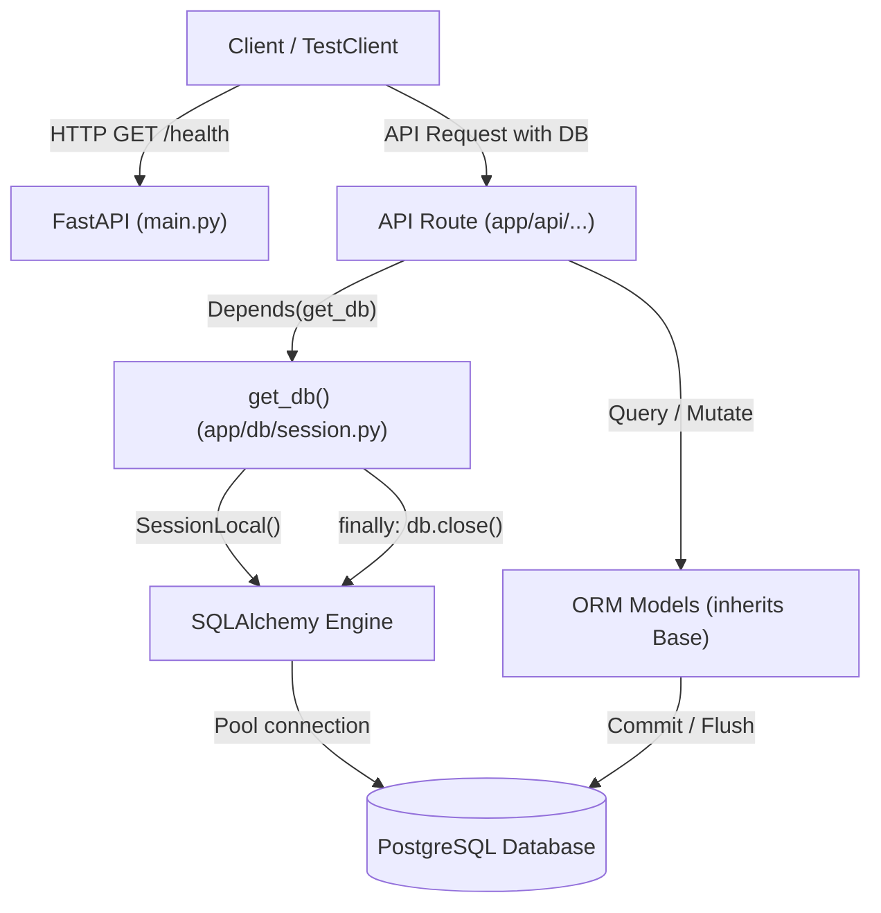

# Milestone Execution & Revision Log

> **Purpose of this Document**  
> This document is the detailed technical chronicle and revision guide for the **Evidence-Driven AI Research & Experimentation Platform**.  
> While `milestone.md` tracks the immediate living state (current status, immediate tasks), this log preserves the deep technical context, rationale, architectural decisions, code structure, database mechanics, and revision notes for each milestone.  
> Whenever you return to this project after days, weeks, or months, read this document to quickly refresh your memory on what was built, why it was designed that way, and how all parts function together.

---

## Table of Contents
1. [Milestone 0: Foundation & Development Environment](#milestone-0-foundation--development-environment)
   - [1. Objective & Problem Solved](#1-objective--problem-solved)
   - [2. Why These Technologies? (Architecture & Tradeoffs)](#2-why-these-technologies-architecture--tradeoffs)
   - [3. Codebase Architecture & Directory Structure](#3-codebase-architecture--directory-structure)
   - [4. Deep-Dive: File-by-File Breakdown](#4-deep-dive-file-by-file-breakdown)
   - [5. How Components Connect & Request Flow](#5-how-components-connect--request-flow)
   - [6. Database Configuration & Pytest Isolation Strategy](#6-database-configuration--pytest-isolation-strategy)
   - [7. How to Run, Test, and Verify](#7-how-to-run-test-and-verify)
   - [8. Revision Summary & Interview Talking Points](#8-revision-summary--interview-talking-points)
2. [Milestone 1: Research Project Management](#milestone-1-research-project-management)
   - [1. Objective & Problem Solved](#1-objective--problem-solved-1)
   - [2. What the API Exposes](#2-what-the-api-exposes)
   - [3. Layered Architecture & Why](#3-layered-architecture--why)
   - [4. Deep-Dive: File-by-File Breakdown](#4-deep-dive-file-by-file-breakdown-1)
   - [5. Key Design Decisions & Tradeoffs](#5-key-design-decisions--tradeoffs)
   - [6. Database Schema & Migration](#6-database-schema--migration)
   - [7. How to Run, Test, and Verify](#7-how-to-run-test-and-verify-1)
   - [8. Revision Summary & Interview Talking Points](#8-revision-summary--interview-talking-points-1)

---

# Milestone 0: Foundation & Development Environment

- **Status**: Completed
- **Version**: `v0.1`
- **Git Commit**: `efa8436` (*feat: initialize project with backend foundation and pytest setup*)

---

### 1. Objective & Problem Solved

#### The Problem
Before building complex retrieval pipelines, embeddings, or agentic workflows, an AI system needs a rock-solid, production-grade engineering foundation. Without proper configuration management, database migration tooling, connection pooling, and transactional test isolation:
- Schema updates break running code and corrupt data.
- Unit and integration tests pollute development databases.
- Configuration secrets get accidentally committed or hardcoded.
- Architecture degrades into an unmaintainable tangle of script-like files.

#### The Solution
Milestone 0 establishes:
1. A **Modular Monolith** structure separating routing, configuration, data access, business logic, and schemas.
2. A **PostgreSQL** relational persistence layer using modern **SQLAlchemy 2.0** declarative ORM mapping.
3. Version-controlled database migrations via **Alembic**.
4. Strict environment-variable and configuration management via **Pydantic Settings** (`.env`).
5. A deterministic **Pytest** testing suite with automated transactional rollbacks and isolated test databases.

---

### 2. Why These Technologies? (Architecture & Tradeoffs)

In alignment with our project philosophy (*"What problem are we solving?" before "What technology should we use?"*), here is the technical justification for every choice:

| Technology | Problem It Solves | Alternatives Considered | Tradeoff / Justification |
| :--- | :--- | :--- | :--- |
| **FastAPI** | High-performance, asynchronous web framework with automatic OpenAPI documentation and native Pydantic validation. | Flask, Django, Express/Node.js | Django is overly opinionated and heavy for an AI-centric backend; Flask lacks native async and modern type-driven schema validation. FastAPI provides speed, async I/O (critical for future LLM API calls and streaming), and automatic Swagger docs at `/docs`. |
| **PostgreSQL** | Reliable, ACID-compliant relational data store with advanced querying capabilities. | SQLite, MongoDB, MySQL | Research papers have strict relational metadata (projects, documents, pages, chunks, extraction claims, experiment runs). Furthermore, PostgreSQL natively supports `pgvector` for vector embeddings in future milestones, avoiding the need to run an external vector DB prematurely. SQLite lacks production concurrency and robust vector extensions. |
| **SQLAlchemy 2.0** | Object-Relational Mapper (ORM) and SQL generation library using modern type-annotated declarative syntax (`Mapped`, `mapped_column`). | Raw SQL, Tortoise ORM, Peewee | Raw SQL lacks type safety and schema change tracking; older SQLAlchemy 1.4 syntax relies on untyped `Column` definitions. SQLAlchemy 2.0 provides static type checking (Mypy), IDE autocompletion, and mature ecosystem support. |
| **Psycopg 3 (`psycopg[binary]`)** | Modern PostgreSQL database adapter/driver for Python. | `psycopg2-binary`, `asyncpg` | Psycopg 3 is the modern rewrite of Psycopg. It supports native Python types, connection pooling, client-side binding, and both synchronous and asynchronous modes, replacing the legacy `psycopg2`. |
| **Alembic** | Lightweight database migration tool specifically designed for SQLAlchemy. | Manual DDL scripts, Django migrations | Manual SQL scripts cause schema drift across machines. Alembic auto-generates migration revisions by comparing SQLAlchemy metadata against the live database schema. |
| **Pydantic v2 & `pydantic-settings`** | Validates environment variables and enforces types at startup. | `python-dotenv` alone, `os.environ.get()` | Hardcoding `os.environ.get()` fails silently or late at runtime when a variable is missing. Pydantic validates all environment variables on boot and fails immediately with a descriptive error if variables are missing or misconfigured. |
| **Pytest with Transactional Fixtures** | Deterministic, isolated automated testing. | `unittest` | Provides clean fixture-based dependency injection. Enables transactional rollbacks (`session.rollback()`) after each test to keep the test database clean without slow table rebuilds. |

---

### 3. Codebase Architecture & Directory Structure

The project uses a **Modular Monolith** pattern:

```text
research-platform/
├── AGENTS.md                  # Development principles, rules, and long-term roadmap
├── milestone.md               # Authoritative living state of the current milestone
├── README.md                  # Project overview and developer onboarding
├── requirements.txt           # Core Python dependencies
├── docs/                      # Architectural decisions and detailed documentation
│   ├── architecture.md        # Architectural decision records (ADRs)
│   └── milestone_log.md       # Detailed milestone execution & revision log (this file)
├── data/                      # Local storage for uploaded research PDFs & artifacts
└── backend/                   # FastAPI backend root
    ├── .env                   # Local environment variables (database connection string)
    ├── .gitignore             # Git ignore rules for backend (.env, cache, etc.)
    ├── alembic.ini            # Alembic CLI configuration
    ├── pytest.ini             # Pytest configuration (pythonpath, testpaths)
    ├── alembic/               # Database migration scripts
    │   ├── env.py             # Alembic migration runner script
    │   ├── script.py.mako     # Template for generating new migration versions
    │   └── versions/          # Version-controlled migration scripts
    ├── app/                   # Application source package
    │   ├── main.py            # FastAPI entrypoint (app instance, middleware, router mount)
    │   ├── api/               # API route handlers (endpoints grouped by feature)
    │   ├── core/              # Central configuration, settings, security, logging
    │   │   └── config.py      # Pydantic Settings class loading .env
    │   ├── db/                # Database engine, session management, base declarative class
    │   │   ├── base_class.py  # Declarative Base class with default id, created_at, updated_at
    │   │   └── session.py     # Engine creation and get_db session dependency
    │   ├── models/            # SQLAlchemy database ORM models
    │   │   └── __init__.py    # Central export of all ORM models for Alembic discovery
    │   ├── schemas/           # Pydantic request/response schemas (data transfer objects)
    │   ├── repositories/      # Data access layer (abstracts raw database queries)
    │   └── services/          # Business logic layer (orchestrates workflows, AI, ingestion)
    └── tests/                 # Automated test suite
        ├── conftest.py        # Pytest fixtures: test DB engine, transactional session, TestClient
        ├── test_db.py         # Database connectivity and basic execution tests
        └── test_main.py       # FastAPI application and route integration tests
```

---

### 4. Deep-Dive: File-by-File Breakdown

#### A. Core Configuration: `backend/app/core/config.py`
```python
from pydantic_settings import BaseSettings, SettingsConfigDict

class Settings(BaseSettings):
    database_url: str

    model_config = SettingsConfigDict(env_file=".env")

settings = Settings()
```
- **What it does**: Reads the `.env` file located in `backend/` and loads configuration into a strongly-typed `settings` object.
- **Why it matters**: If `DATABASE_URL` is missing or invalid, Pydantic raises a clear validation error immediately on application startup, preventing confusing runtime database connection crashes later.

#### B. Declarative Base Model: `backend/app/db/base_class.py`
```python
from datetime import datetime
from sqlalchemy import DateTime
from sqlalchemy.orm import DeclarativeBase, Mapped, mapped_column
from sqlalchemy.sql import func

class Base(DeclarativeBase):
    """Base class for all SQLAlchemy declarative models."""

    id: Mapped[int] = mapped_column(primary_key=True, index=True, autoincrement=True)
    created_at: Mapped[datetime] = mapped_column(
        DateTime(timezone=True), server_default=func.now(), nullable=False
    )
    updated_at: Mapped[datetime] = mapped_column(
        DateTime(timezone=True),
        server_default=func.now(),
        onupdate=func.now(),
        nullable=False,
    )
```
- **What it does**: Defines the root base class that every future ORM model inherits from.
- **Key design decisions**:
  - `Mapped[int]` and `Mapped[datetime]` utilize SQLAlchemy 2.0 type hints for static analysis.
  - Automatically furnishes all inheriting tables with an auto-incrementing integer `id` and timezone-aware audit timestamps (`created_at`, `updated_at`).
  - `server_default=func.now()` ensures the timestamp is generated by the PostgreSQL server clock, avoiding local timezone discrepancies.

#### C. Database Session & FastAPI Dependency: `backend/app/db/session.py`
```python
from sqlalchemy import create_engine
from sqlalchemy.orm import sessionmaker
from app.core.config import settings

engine = create_engine(settings.database_url)
SessionLocal = sessionmaker(autocommit=False, autoflush=False, bind=engine)

def get_db():
    db = SessionLocal()
    try:
        yield db
    finally:
        db.close()
```
- **What it does**: Initializes the SQLAlchemy `Engine` (which maintains a connection pool to PostgreSQL) and creates a factory `SessionLocal` for producing isolated database sessions.
- **`get_db()` Dependency Pattern**: Designed for FastAPI dependency injection (`Depends(get_db)`). Each incoming HTTP request receives its own session, and the `finally` block guarantees that the connection is closed and returned to the pool even if an unhandled exception occurs.

#### D. Central Model Registry: `backend/app/models/__init__.py`
```python
from app.db.base_class import Base

# Import all models here so Alembic can discover them
# from app.models.project import Project
```
- **What it does**: Imports `Base` and serves as the single registration point for all database entities.
- **Why it matters**: Alembic’s autogenerate detects tables by inspecting `Base.metadata`. If a model is defined in a separate file but never imported, Alembic will fail to detect it. Importing all models in `models/__init__.py` ensures Alembic discovers the entire schema.

#### E. Database Migrations Runner: `backend/alembic/env.py`
- Connects Alembic to the application configuration by dynamically pulling `settings.database_url`.
- Sets `target_metadata = Base.metadata` so `alembic revision --autogenerate` can compare the database state against our declared models.

#### F. FastAPI Application Scaffolding: `backend/app/main.py`
```python
from fastapi import FastAPI

app = FastAPI(title="Research Platform")

@app.get("/health")
def health():
    return {"status": "ok"}
```
- Exposes the ASGI application entry point.
- Provides a health check endpoint at `/health` to verify server responsiveness.

---

### 5. How Components Connect & Request Flow



---

### 6. Database Configuration & Pytest Isolation Strategy

#### Two Distinct Databases
To avoid accidental data loss or test pollution, development and testing environments are strictly separated:
- **Development Database**: `research_platform` (specified in `backend/.env`)
- **Test Database**: `research_platform_test` (specified in `backend/tests/conftest.py`)

#### How Transactional Isolation Works in `backend/tests/conftest.py`
Running tests should not leave residual data in the database, nor should it require dropping and recreating all tables on every individual test (which would make the test suite slow).

We solved this using **SQLAlchemy nested transactions & connection rollbacks**:
1. **Session Scope (`setup_test_database`)**: Runs once per test run. Drops and recreates all tables in `research_platform_test` to ensure schema consistency.
2. **Function Scope (`db_session`)**:
   - Opens a connection: `connection = test_engine.connect()`
   - Begins a transaction: `transaction = connection.begin()`
   - Binds the session to this transaction: `session = TestingSessionLocal(bind=connection)`
   - Yields the session to the test.
   - When the test finishes, rolls back the transaction: `transaction.rollback()` and closes the connection.
   - **Result**: Any records inserted during the test are instantly discarded by the database transaction rollback. Each test runs in pristine isolation.
3. **Client Fixture (`client`)**: Overrides `app.dependency_overrides[get_db]` so any API call made via `TestClient` uses the exact same transactional session.

---

### 7. How to Run, Test, and Verify

#### 1. Setup & Dependencies
```bash
# From project root:
source .venv/bin/activate
pip install -r requirements.txt
```

#### 2. Environment Configuration
Ensure `backend/.env` contains your PostgreSQL connection string:
```env
DATABASE_URL=postgresql+psycopg://<username>@localhost:5432/research_platform
```

Ensure the databases exist in PostgreSQL:
```bash
createdb research_platform
createdb research_platform_test
```

#### 3. Database Migrations
```bash
# Navigate to backend directory to run alembic
cd backend
alembic upgrade head
```

#### 4. Running the Development Server
```bash
cd backend
uvicorn app.main:app --reload --port 8000
```
- Open Swagger documentation: [http://localhost:8000/docs](http://localhost:8000/docs)
- Health check verification: [http://localhost:8000/health](http://localhost:8000/health) returns `{"status": "ok"}`

#### 5. Running Automated Tests
```bash
# Run pytest on backend tests
pytest backend/tests
```
Expected output:
- `test_database_session`: verifies test database connection and basic query execution (`SELECT 1`).
- `test_ping`: verifies FastAPI test client and 404 handler.

---

### 8. Revision Summary & Interview Talking Points

If asked about this foundation in an interview:

1. **Why SQLAlchemy 2.0 style over 1.x?**  
   *"We use SQLAlchemy 2.0 declarative syntax with `Mapped` and `mapped_column`. This gives full static type checking with Mypy and Python's typing system, preventing runtime attribute errors and providing superior developer ergonomics compared to the legacy untyped `Column` syntax."*

2. **How is test isolation achieved without mocking the database?**  
   *"Rather than mocking the database or wiping tables between each test, we use transactional rollbacks. Pytest opens a connection and begins a database transaction before the test executes, binds the session to that transaction, and rolls it back in the fixture teardown. The test operates against real PostgreSQL behavior, but no data is ever permanently written."*

3. **Why choose PostgreSQL over a pure vector database at this stage?**  
   *"A research platform has rich relational constraints: users organize research into projects, documents belong to projects, chunks have page and section provenance, and experiments track structured evaluation metrics. PostgreSQL handles all relational integrity, and via `pgvector`, can later provide dense vector search without introducing multiple distributed databases prematurely."*

---

# Milestone 1: Research Project Management

- **Status**: Completed
- **Version**: `v0.1`
- **Git Commit**: `feat: add project CRUD — model, schemas, repository, API endpoints, and tests`

---

### 1. Objective & Problem Solved

#### The Problem
Our backend foundation from Milestone 0 can start, connect to PostgreSQL, and pass tests — but it has no domain knowledge. It has no concept of a "research project". Before we can upload papers, run searches, or track experiments, we need a root organizing entity that everything else will belong to.

#### The Solution
Introduce the `Project` entity — the top-level workspace in the platform. A researcher can create a named project (e.g., *"RAG Hallucination Research"*) and all future work — documents, chunks, search results, experiment runs — will be scoped to that project.

This milestone also establishes the **full layered architecture pattern** (Model → Schema → Repository → API) that every future feature will follow.

---

### 2. What the API Exposes

All endpoints are mounted under `/api`:

| Method | Endpoint | Description | Success Status |
|:---|:---|:---|:---|
| `POST` | `/api/projects` | Create a new project | `201 Created` |
| `GET` | `/api/projects` | List all projects (newest first) | `200 OK` |
| `GET` | `/api/projects/{id}` | Get a single project by ID | `200 OK` |
| `PATCH` | `/api/projects/{id}` | Partially update a project | `200 OK` |
| `DELETE` | `/api/projects/{id}` | Delete a project | `204 No Content` |

**API versioning decision**: We deliberately kept endpoints flat at `/api/projects` rather than nesting under `/api/v1/projects`. URL versioning only becomes necessary when you need to run two incompatible API versions simultaneously for different clients. We have no existing clients and no breaking changes to protect — adding the `v1/` folder would be complexity for a problem we don't have.

---

### 3. Layered Architecture & Why

Every feature in this project follows a strict 4-layer separation. Here is what each layer owns and why the separation matters:

```
HTTP Request
     │
     ▼
┌───────────────────────────────────┐
│  API Layer (endpoints/projects.py) │  Receives request, validates input via Pydantic,
│                                    │  returns typed response. No SQL here.
└──────────────────┬────────────────┘
                   │
                   ▼
┌────────────────────────────────────────────┐
│  Repository Layer (project_repository.py)   │  The ONLY place that writes SQL / ORM queries.
│                                            │  Receives a Session, returns ORM objects.
└──────────────────┬─────────────────────────┘
                   │
                   ▼
┌──────────────────────────────────┐
│  ORM Model Layer (project.py)    │  Declares the `projects` table structure.
│                                  │  Maps Python class attributes to DB columns.
└──────────────────────────────────┘

Pydantic Schemas (schemas/project.py) — Cross-cutting: validate API input & serialize output.
```

**Why not just write SQL inside the route handler?**  
Route handlers become 100-line functions that mix HTTP concerns, validation, and SQL. The moment you want to add pagination, caching, or bulk operations, you have to untangle everything. Repositories keep queries in one testable, reusable place.

**Why a separate schemas layer from models?**  
The ORM model reflects the database — it owns `id`, `created_at`, `updated_at`, and potentially future internal/sensitive fields. Pydantic schemas reflect the API contract — what the client is allowed to send and receive. If you expose the ORM object directly, you lose control over what gets serialized (fields may appear or disappear depending on ORM loading state).

---

### 4. Deep-Dive: File-by-File Breakdown

#### A. ORM Model: `backend/app/models/project.py`
```python
class Project(Base):
    __tablename__ = "projects"

    title: Mapped[str] = mapped_column(nullable=False)
    description: Mapped[Optional[str]] = mapped_column(nullable=True)
```
- Inherits `id`, `created_at`, `updated_at` from `Base` (Milestone 0).
- `Mapped[str]` and `Mapped[Optional[str]]` use SQLAlchemy 2.0 typed syntax — Python's type checker understands these as actual `str` / `str | None` types, not opaque `Column` descriptors.
- `nullable=False` on `title` means PostgreSQL will enforce that a title must always be present at the database level — not just at the API validation level. Defense in depth.

#### B. Model Registry: `backend/app/models/__init__.py`
```python
from app.db.base_class import Base
from app.models.project import Project  # registered for Alembic
```
- Alembic's autogenerate works by inspecting `Base.metadata` — the registry of all tables. If `Project` is never imported anywhere that `Base.metadata` can see, Alembic silently ignores it and generates an empty migration. This import makes it visible.

#### C. Pydantic Schemas: `backend/app/schemas/project.py`

Three schemas, each with a specific job:

| Schema | Purpose | Key Design |
|:---|:---|:---|
| `ProjectCreate` | Client → API when creating | `title` required, `description` optional |
| `ProjectUpdate` | Client → API when updating | All fields optional (partial update) |
| `ProjectRead` | API → Client in response | Includes `id`, `created_at`, `updated_at` |

```python
class ProjectRead(BaseModel):
    model_config = {"from_attributes": True}
```
`from_attributes = True` tells Pydantic: "when converting, read attributes off the object directly, not just from a dict". This is required to convert a SQLAlchemy ORM instance into a Pydantic model. Without it you get a `ValidationError`.

#### D. Repository: `backend/app/repositories/project_repository.py`

Key implementation detail — the `update` method:
```python
def update(self, project: Project, data: ProjectUpdate) -> Project:
    update_data = data.model_dump(exclude_unset=True)
    for field, value in update_data.items():
        setattr(project, field, value)
    self.db.commit()
    self.db.refresh(project)
    return project
```
- `model_dump(exclude_unset=True)` returns only the fields the client actually sent in the request body. If the client sends `{"title": "New Title"}` and omits `description`, the dict is `{"title": "New Title"}` — not `{"title": "New Title", "description": None}`. This prevents accidentally overwriting a field with `None` just because the client didn't include it.
- `db.refresh(project)` re-reads the row from the database after commit. This ensures `updated_at` (which PostgreSQL updates on the server side) is reflected in the returned object.

#### E. API Endpoints: `backend/app/api/endpoints/projects.py`
```python
router = APIRouter(prefix="/projects", tags=["Projects"])
```
- `prefix="/projects"` means all routes in this file are automatically under `/projects`. When mounted with `prefix="/api"` in `main.py`, the full path becomes `/api/projects`.
- `tags=["Projects"]` groups all these routes under a "Projects" section in the Swagger UI (`/docs`).
- `status_code=status.HTTP_201_CREATED` on the `POST` route — creation should return `201`, not `200`. This is the semantically correct HTTP status.
- `status_code=status.HTTP_204_NO_CONTENT` on `DELETE` — successful deletion returns no body, which is why `204` is correct (not `200`).

#### F. Central Router: `backend/app/api/router.py`
```python
from app.api.endpoints import projects
router = APIRouter()
router.include_router(projects.router)
```
- Acts as a central registry. When Milestone 2 adds `documents.py`, it gets one line added here: `router.include_router(documents.router)`. `main.py` doesn't need to change.

#### G. Application Mount: `backend/app/main.py`
```python
app.include_router(api_router, prefix="/api")
```
- The `/api` prefix is applied globally here. Every future feature mounted through `api/router.py` automatically lives under `/api/...`.

---

### 5. Key Design Decisions & Tradeoffs

| Decision | Chosen Approach | Alternative | Why |
|:---|:---|:---|:---|
| **API versioning** | Flat `/api/projects` | `/api/v1/projects` | No existing clients, no breaking changes. Versioning adds complexity for a problem that doesn't exist yet. |
| **Partial update method** | `PATCH` with `exclude_unset=True` | `PUT` full replacement | `PUT` forces the client to send all fields even if only one changed. `PATCH` is semantically correct for partial updates and prevents accidental overwrites. |
| **Repository pattern** | Dedicated repository class | SQL in route handler | Keeps route handlers slim, makes queries reusable, and makes the data access layer independently testable. |
| **No service layer** | Skipped for simple CRUD | Service layer for all features | A service layer makes sense when business logic is complex (e.g., "creating a project also needs to initialize an embedding index"). For basic CRUD, it would just be empty pass-through code. |
| **Integer primary key** | `id: int` autoincrement | UUID | Integer PKs are simpler, faster for joins, and sufficient at this stage. UUIDs become valuable when distributing data across systems or exposing IDs externally — not a current requirement. |

---

### 6. Database Schema & Migration

#### Resulting `projects` table in PostgreSQL:

| Column | PostgreSQL Type | Constraints |
|:---|:---|:---|
| `id` | `INTEGER` | PRIMARY KEY, NOT NULL, AUTO INCREMENT |
| `title` | `VARCHAR` | NOT NULL |
| `description` | `VARCHAR` | NULLABLE |
| `created_at` | `TIMESTAMP WITH TIME ZONE` | NOT NULL, DEFAULT `now()` |
| `updated_at` | `TIMESTAMP WITH TIME ZONE` | NOT NULL, DEFAULT `now()` |

#### Migration commands:
```bash
cd backend
alembic revision --autogenerate -m "create project table"
alembic upgrade head
```
- `--autogenerate` — Alembic connects to the DB, inspects existing tables, compares with `Base.metadata`, and generates the SQL diff.
- `upgrade head` — Applies all unapplied migrations up to the latest version.

The generated migration file lives in `backend/alembic/versions/` and is committed to Git so every developer and every deployment environment runs the exact same schema changes in the same order.

---

### 7. How to Run, Test, and Verify

#### Run the server:
```bash
cd backend
source ../.venv/bin/activate
uvicorn app.main:app --reload --port 8000
```
- Swagger UI: [http://localhost:8000/docs](http://localhost:8000/docs)
- Try creating a project, listing, updating, and deleting via the interactive docs.

#### Run the tests:
```bash
cd /path/to/research-platform
.venv/bin/pytest backend/tests/ -v
```

#### All 11 tests that pass:
| Test | What it verifies |
|:---|:---|
| `test_create_project_success` | `POST` returns `201` with correct fields including `id` and timestamps |
| `test_create_project_with_description` | Optional description is stored correctly |
| `test_create_project_missing_title` | Missing required field returns `422 Unprocessable Entity` (Pydantic validation) |
| `test_list_projects_empty` | Empty database returns an empty list `[]` |
| `test_list_projects_returns_created` | Created projects appear in the list |
| `test_get_project_by_id` | Correct project returned for a valid ID |
| `test_get_project_not_found` | Non-existent ID returns `404` with `"Project not found"` |
| `test_update_project_title` | Only the title changes; description remains untouched |
| `test_update_project_not_found` | `PATCH` on non-existent ID returns `404` |
| `test_delete_project` | `DELETE` returns `204`; subsequent `GET` returns `404` |
| `test_delete_project_not_found` | `DELETE` on non-existent ID returns `404` |

---

### 8. Revision Summary & Interview Talking Points

If asked about this milestone in an interview:

1. **Why PATCH instead of PUT for updates?**
   *"PUT requires the client to send the entire resource representation. PATCH is semantically correct for partial updates. Practically, we use `model_dump(exclude_unset=True)` in the Pydantic schema so only the fields the client explicitly provided are applied — this prevents accidentally overwriting existing data with `None` when the client omits a field."*

2. **Why a Repository layer? Isn't it overkill for simple CRUD?**
   *"For simple CRUD it adds one file of indirection. The payoff comes when you need pagination, soft deletes, caching, or bulk operations — all in one place rather than scattered across route handlers. It also makes testing cleaner: the repository gets a session injected, so you can test queries directly without going through HTTP."*

3. **How does `from_attributes = True` work in Pydantic?**
   *"By default, Pydantic reads data from dict-like inputs. SQLAlchemy ORM objects aren't dicts — they're Python objects with attributes. `from_attributes = True` tells Pydantic to call `getattr(obj, field_name)` instead of `obj[field_name]`, which is how it can deserialize a SQLAlchemy model instance directly."*

4. **Why keep the API flat at `/api/projects` rather than `/api/v1/projects`?**
   *"URL versioning only matters when you need two incompatible API versions running at the same time — for example, old mobile app clients that can't be updated. We have no existing clients. Adding the `v1/` directory would be complexity for a problem we don't have. We can always introduce `v2/` when there's a genuine breaking change."*

---

*(This document will be updated as subsequent milestones are completed.)*

