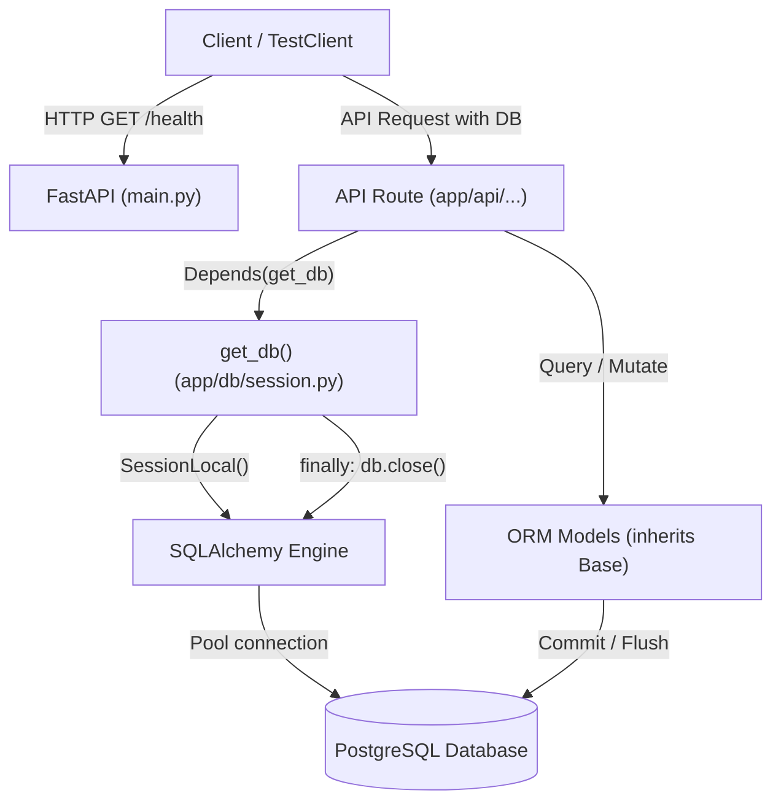

# Milestone 0: Foundation & Development Environment

- **Status**: Completed
- **Version**: `v0.1`
- **Git Commit**: `efa8436` (*feat: initialize project with backend foundation and pytest setup*)

---

### 1. Objective & Problem Solved

#### The Problem
Before building complex retrieval pipelines, embeddings, or agentic workflows, an AI system needs a rock-solid, production-grade engineering foundation. Without proper configuration management, database migration tooling, connection pooling, and transactional test isolation:
- Schema updates break running code and corrupt data.
- Unit and integration tests pollute development databases.
- Configuration secrets get accidentally committed or hardcoded.
- Architecture degrades into an unmaintainable tangle of script-like files.

#### The Solution
Milestone 0 establishes:
1. A **Modular Monolith** structure separating routing, configuration, data access, business logic, and schemas.
2. A **PostgreSQL** relational persistence layer using modern **SQLAlchemy 2.0** declarative ORM mapping.
3. Version-controlled database migrations via **Alembic**.
4. Strict environment-variable and configuration management via **Pydantic Settings** (`.env`).
5. A deterministic **Pytest** testing suite with automated transactional rollbacks and isolated test databases.

---

### 2. Why These Technologies? (Architecture & Tradeoffs)

In alignment with our project philosophy (*"What problem are we solving?" before "What technology should we use?"*), here is the technical justification for every choice:

| Technology | Problem It Solves | Alternatives Considered | Tradeoff / Justification |
| :--- | :--- | :--- | :--- |
| **FastAPI** | High-performance, asynchronous web framework with automatic OpenAPI documentation and native Pydantic validation. | Flask, Django, Express/Node.js | Django is overly opinionated and heavy for an AI-centric backend; Flask lacks native async and modern type-driven schema validation. FastAPI provides speed, async I/O (critical for future LLM API calls and streaming), and automatic Swagger docs at `/docs`. |
| **PostgreSQL** | Reliable, ACID-compliant relational data store with advanced querying capabilities. | SQLite, MongoDB, MySQL | Research papers have strict relational metadata (projects, documents, pages, chunks, extraction claims, experiment runs). Furthermore, PostgreSQL natively supports `pgvector` for vector embeddings in future milestones, avoiding the need to run an external vector DB prematurely. SQLite lacks production concurrency and robust vector extensions. |
| **SQLAlchemy 2.0** | Object-Relational Mapper (ORM) and SQL generation library using modern type-annotated declarative syntax (`Mapped`, `mapped_column`). | Raw SQL, Tortoise ORM, Peewee | Raw SQL lacks type safety and schema change tracking; older SQLAlchemy 1.4 syntax relies on untyped `Column` definitions. SQLAlchemy 2.0 provides static type checking (Mypy), IDE autocompletion, and mature ecosystem support. |
| **Psycopg 3 (`psycopg[binary]`)** | Modern PostgreSQL database adapter/driver for Python. | `psycopg2-binary`, `asyncpg` | Psycopg 3 is the modern rewrite of Psycopg. It supports native Python types, connection pooling, client-side binding, and both synchronous and asynchronous modes, replacing the legacy `psycopg2`. |
| **Alembic** | Lightweight database migration tool specifically designed for SQLAlchemy. | Manual DDL scripts, Django migrations | Manual SQL scripts cause schema drift across machines. Alembic auto-generates migration revisions by comparing SQLAlchemy metadata against the live database schema. |
| **Pydantic v2 & `pydantic-settings`** | Validates environment variables and enforces types at startup. | `python-dotenv` alone, `os.environ.get()` | Hardcoding `os.environ.get()` fails silently or late at runtime when a variable is missing. Pydantic validates all environment variables on boot and fails immediately with a descriptive error if variables are missing or misconfigured. |
| **Pytest with Transactional Fixtures** | Deterministic, isolated automated testing. | `unittest` | Provides clean fixture-based dependency injection. Enables transactional rollbacks (`session.rollback()`) after each test to keep the test database clean without slow table rebuilds. |

---

### 3. Codebase Architecture & Directory Structure

The project uses a **Modular Monolith** pattern:

```text
research-platform/
├── AGENTS.md                  # Development principles, rules, and long-term roadmap
├── milestone.md               # Authoritative living state of the current milestone
├── README.md                  # Project overview and developer onboarding
├── requirements.txt           # Core Python dependencies
├── docs/                      # Architectural decisions and detailed documentation
│   ├── architecture.md        # Architectural decision records (ADRs)
│   └── milestone_log.md       # Detailed milestone execution & revision log (this file)
├── data/                      # Local storage for uploaded research PDFs & artifacts
└── backend/                   # FastAPI backend root
    ├── .env                   # Local environment variables (database connection string)
    ├── .gitignore             # Git ignore rules for backend (.env, cache, etc.)
    ├── alembic.ini            # Alembic CLI configuration
    ├── pytest.ini             # Pytest configuration (pythonpath, testpaths)
    ├── alembic/               # Database migration scripts
    │   ├── env.py             # Alembic migration runner script
    │   ├── script.py.mako     # Template for generating new migration versions
    │   └── versions/          # Version-controlled migration scripts
    ├── app/                   # Application source package
    │   ├── main.py            # FastAPI entrypoint (app instance, middleware, router mount)
    │   ├── api/               # API route handlers (endpoints grouped by feature)
    │   ├── core/              # Central configuration, settings, security, logging
    │   │   └── config.py      # Pydantic Settings class loading .env
    │   ├── db/                # Database engine, session management, base declarative class
    │   │   ├── base_class.py  # Declarative Base class with default id, created_at, updated_at
    │   │   └── session.py     # Engine creation and get_db session dependency
    │   ├── models/            # SQLAlchemy database ORM models
    │   │   └── __init__.py    # Central export of all ORM models for Alembic discovery
    │   ├── schemas/           # Pydantic request/response schemas (data transfer objects)
    │   ├── repositories/      # Data access layer (abstracts raw database queries)
    │   └── services/          # Business logic layer (orchestrates workflows, AI, ingestion)
    └── tests/                 # Automated test suite
        ├── conftest.py        # Pytest fixtures: test DB engine, transactional session, TestClient
        ├── test_db.py         # Database connectivity and basic execution tests
        └── test_main.py       # FastAPI application and route integration tests
```

---

### 4. Deep-Dive: File-by-File Breakdown

#### A. Core Configuration: `backend/app/core/config.py`
```python
from pydantic_settings import BaseSettings, SettingsConfigDict

class Settings(BaseSettings):
    database_url: str

    model_config = SettingsConfigDict(env_file=".env")

settings = Settings()
```
- **What it does**: Reads the `.env` file located in `backend/` and loads configuration into a strongly-typed `settings` object.
- **Why it matters**: If `DATABASE_URL` is missing or invalid, Pydantic raises a clear validation error immediately on application startup, preventing confusing runtime database connection crashes later.

#### B. Declarative Base Model: `backend/app/db/base_class.py`
```python
from datetime import datetime
from sqlalchemy import DateTime
from sqlalchemy.orm import DeclarativeBase, Mapped, mapped_column
from sqlalchemy.sql import func

class Base(DeclarativeBase):
    """Base class for all SQLAlchemy declarative models."""

    id: Mapped[int] = mapped_column(primary_key=True, index=True, autoincrement=True)
    created_at: Mapped[datetime] = mapped_column(
        DateTime(timezone=True), server_default=func.now(), nullable=False
    )
    updated_at: Mapped[datetime] = mapped_column(
        DateTime(timezone=True),
        server_default=func.now(),
        onupdate=func.now(),
        nullable=False,
    )
```
- **What it does**: Defines the root base class that every future ORM model inherits from.
- **Key design decisions**:
  - `Mapped[int]` and `Mapped[datetime]` utilize SQLAlchemy 2.0 type hints for static analysis.
  - Automatically furnishes all inheriting tables with an auto-incrementing integer `id` and timezone-aware audit timestamps (`created_at`, `updated_at`).
  - `server_default=func.now()` ensures the timestamp is generated by the PostgreSQL server clock, avoiding local timezone discrepancies.

#### C. Database Session & FastAPI Dependency: `backend/app/db/session.py`
```python
from sqlalchemy import create_engine
from sqlalchemy.orm import sessionmaker
from app.core.config import settings

engine = create_engine(settings.database_url)
SessionLocal = sessionmaker(autocommit=False, autoflush=False, bind=engine)

def get_db():
    db = SessionLocal()
    try:
        yield db
    finally:
        db.close()
```
- **What it does**: Initializes the SQLAlchemy `Engine` (which maintains a connection pool to PostgreSQL) and creates a factory `SessionLocal` for producing isolated database sessions.
- **`get_db()` Dependency Pattern**: Designed for FastAPI dependency injection (`Depends(get_db)`). Each incoming HTTP request receives its own session, and the `finally` block guarantees that the connection is closed and returned to the pool even if an unhandled exception occurs.

#### D. Central Model Registry: `backend/app/models/__init__.py`
```python
from app.db.base_class import Base

# Import all models here so Alembic can discover them
# from app.models.project import Project
```
- **What it does**: Imports `Base` and serves as the single registration point for all database entities.
- **Why it matters**: Alembic's autogenerate detects tables by inspecting `Base.metadata`. If a model is defined in a separate file but never imported, Alembic will fail to detect it. Importing all models in `models/__init__.py` ensures Alembic discovers the entire schema.

#### E. Database Migrations Runner: `backend/alembic/env.py`
- Connects Alembic to the application configuration by dynamically pulling `settings.database_url`.
- Sets `target_metadata = Base.metadata` so `alembic revision --autogenerate` can compare the database state against our declared models.

#### F. FastAPI Application Scaffolding: `backend/app/main.py`
```python
from fastapi import FastAPI

app = FastAPI(title="Research Platform")

@app.get("/health")
def health():
    return {"status": "ok"}
```
- Exposes the ASGI application entry point.
- Provides a health check endpoint at `/health` to verify server responsiveness.

---

### 5. How Components Connect & Request Flow



---

### 6. Database Configuration & Pytest Isolation Strategy

#### Two Distinct Databases
To avoid accidental data loss or test pollution, development and testing environments are strictly separated:
- **Development Database**: `research_platform` (specified in `backend/.env`)
- **Test Database**: `research_platform_test` (specified in `backend/tests/conftest.py`)

#### How Transactional Isolation Works in `backend/tests/conftest.py`
Running tests should not leave residual data in the database, nor should it require dropping and recreating all tables on every individual test (which would make the test suite slow).

We solved this using **SQLAlchemy nested transactions & connection rollbacks**:
1. **Session Scope (`setup_test_database`)**: Runs once per test run. Drops and recreates all tables in `research_platform_test` to ensure schema consistency.
2. **Function Scope (`db_session`)**:
   - Opens a connection: `connection = test_engine.connect()`
   - Begins a transaction: `transaction = connection.begin()`
   - Binds the session to this transaction: `session = TestingSessionLocal(bind=connection)`
   - Yields the session to the test.
   - When the test finishes, rolls back the transaction: `transaction.rollback()` and closes the connection.
   - **Result**: Any records inserted during the test are instantly discarded by the database transaction rollback. Each test runs in pristine isolation.
3. **Client Fixture (`client`)**: Overrides `app.dependency_overrides[get_db]` so any API call made via `TestClient` uses the exact same transactional session.

---

### 7. How to Run, Test, and Verify

#### 1. Setup & Dependencies
```bash
# From project root:
source .venv/bin/activate
pip install -r requirements.txt
```

#### 2. Environment Configuration
Ensure `backend/.env` contains your PostgreSQL connection string:
```env
DATABASE_URL=postgresql+psycopg://<username>@localhost:5432/research_platform
```

Ensure the databases exist in PostgreSQL:
```bash
createdb research_platform
createdb research_platform_test
```

#### 3. Database Migrations
```bash
# Navigate to backend directory to run alembic
cd backend
alembic upgrade head
```

#### 4. Running the Development Server
```bash
cd backend
uvicorn app.main:app --reload --port 8000
```
- Open Swagger documentation: [http://localhost:8000/docs](http://localhost:8000/docs)
- Health check verification: [http://localhost:8000/health](http://localhost:8000/health) returns `{"status": "ok"}`

#### 5. Running Automated Tests
```bash
# Run pytest on backend tests
pytest backend/tests
```
Expected output:
- `test_database_session`: verifies test database connection and basic query execution (`SELECT 1`).
- `test_ping`: verifies FastAPI test client and 404 handler.

---

### 8. Revision Summary & Interview Talking Points

If asked about this foundation in an interview:

1. **Why SQLAlchemy 2.0 style over 1.x?**  
   *"We use SQLAlchemy 2.0 declarative syntax with `Mapped` and `mapped_column`. This gives full static type checking with Mypy and Python's typing system, preventing runtime attribute errors and providing superior developer ergonomics compared to the legacy untyped `Column` syntax."*

2. **How is test isolation achieved without mocking the database?**  
   *"Rather than mocking the database or wiping tables between each test, we use transactional rollbacks. Pytest opens a connection and begins a database transaction before the test executes, binds the session to that transaction, and rolls it back in the fixture teardown. The test operates against real PostgreSQL behavior, but no data is ever permanently written."*

3. **Why choose PostgreSQL over a pure vector database at this stage?**  
   *"A research platform has rich relational constraints: users organize research into projects, documents belong to projects, chunks have page and section provenance, and experiments track structured evaluation metrics. PostgreSQL handles all relational integrity, and via `pgvector`, can later provide dense vector search without introducing multiple distributed databases prematurely."*
